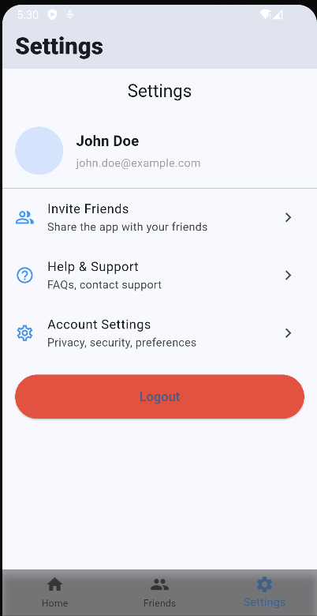
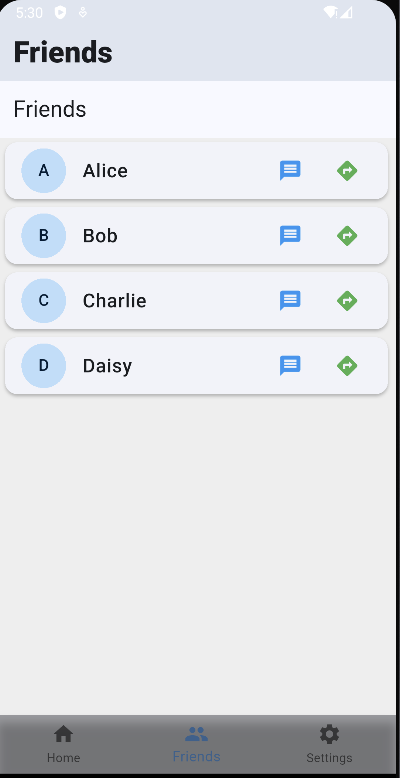

# mixerlocator

A new Flutter based location tracking Application that allows user to track their friends location and also allows the messaging in real-time.

I created this project just for learning puposes particularly about firebase (firestore db), google maps api and google location api.

## features
-**Real Time Location Tracking - Get live updates of your current location**
-**Distance Calculation - Measure the distance between two points.**
-**Offline Support - Works even with limited internet connectivity.**
-**Messaging - Allows to communicate with the users.**

### screenshots

### refrences

[Getting Started - Google Maps](https://developers.google.com/maps/documentation/android-sdk/start)
[FireBase Documentation (Guide)](https://firebase.google.com/docs/guides/)
[Get Started with Firebase Firestore](https://firebase.google.com/docs/firestore/quickstart)
[Firestore Data Model](https://firebase.google.com/docs/firestore/data-model)
[Firestore - Get Data](https://firebase.google.com/docs/firestore/query-data/get-data)
[Firestore - Structure Data](https://firebase.google.com/docs/firestore/manage-data/structure-data)

## how it works ?

The first device get continous location update from gps, network etc. then
Write and update the location data to a specific firebase firestore document
Last, the second device read that firebase firestore document and show the marker in that location

